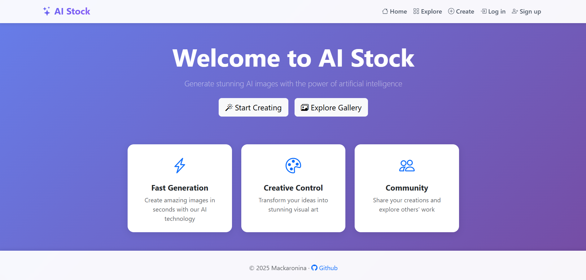
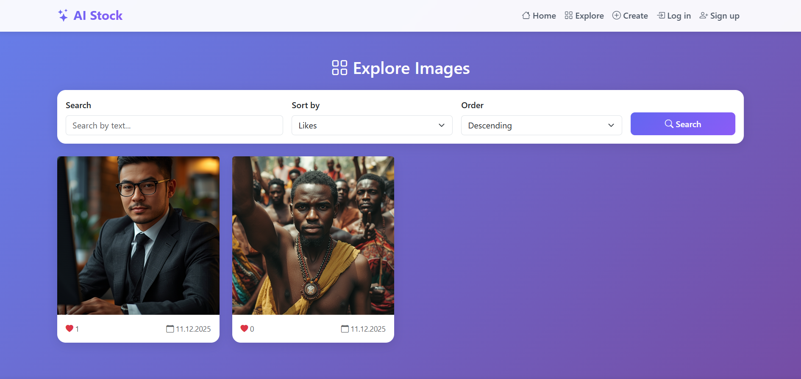

# AI Stock

This is a web application written in the FastAPI Python framework. Users of the site can create their own images using
AI and share them with people, as well as search and rate other people's images. The web application also has fully
working authorization and authentication

### Demonstration

### Features

* Creating and logging into a user account
* Generating images and tags for them using AI
* Search images by text/tags and sort them by date/likes
* Ability to like images
* Ability to make images private or public

### Used technology

* Python 3.12
* FastAPI (Web framework for building HTTP-based service APIs)
* PostgreSQL (Relational database)
* SQLAlchemy 2.x (Object–relational mapper (ORM) for database interactions)
* [Cloudflare Workers AI](https://developers.cloudflare.com/workers-ai/) (API for accessing AI models. Has a free plan)
* [ImgBB API](https://api.imgbb.com) (Free image hosting and sharing service)

### Installation

* Start the PostgreSQL database using any method
* Edit file example.env and fill it with your data including the data for connecting to the database, then rename it to
  .env. This file contains all the settings for the web application
* Run the python script with the following commands:  
  `pip install -r requirements.txt`  
  `python app/main.py`